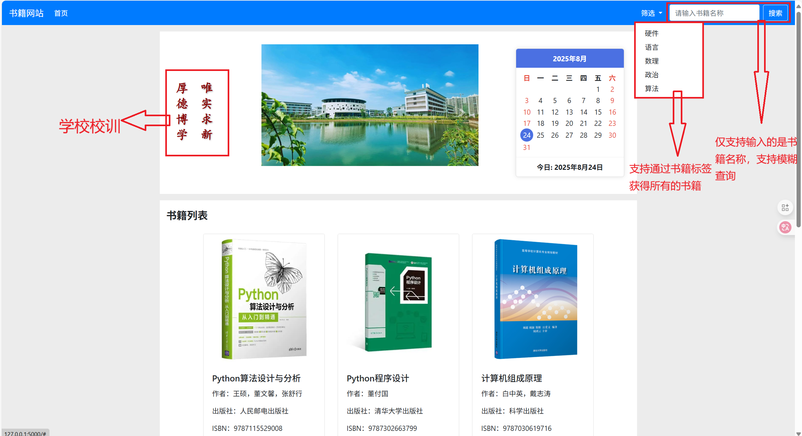
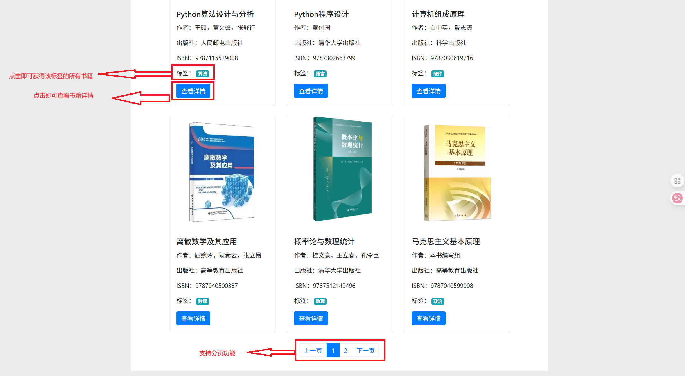

# Flask图书管理系统

这是一个基于Flask框架开发的图书管理系统，提供图书信息的展示、搜索和分类功能。

## 项目结构

```
├── APP/                   # 应用主目录
│   ├── Model.py           # 数据库模型定义
│   ├── View.py            # 视图函数和路由定义
│   ├── __init__.py        # 应用初始化
│   ├── exts.py            # 扩展插件管理
│   ├── static/            # 静态资源
│   │   ├── img/           # 图书封面图片
│   │   └── pdf/           # 图书PDF文件
│   └── templates/         # HTML模板
├── app.py                 # 应用入口
├── fill_data.py           # 数据填充脚本
└── requirements.txt       # 项目依赖
```

## 功能特点

- **图书展示**：首页展示所有图书信息，包括封面、标题、作者等
- **分页功能**：支持图书列表分页浏览
- **分类查看**：根据图书分类（标签）筛选图书
- **搜索功能**：支持图书搜索
- **详细信息**：查看图书详细信息和PDF文件

## 数据库设计

系统使用SQLite数据库，主要包含以下表：

- **Books表**：存储图书信息，包括标题、作者、出版社、ISBN、简介、封面路径、PDF路径等
- **Tip表**：存储图书分类标签

## 安装与运行

### 环境要求

- Python 3.6+
- Flask
- Flask-SQLAlchemy
- Flask-Migrate

### 安装步骤

1. 克隆项目到本地

2. 安装依赖
   
   ```
   pip install -r requirements.txt
   ```

3. 初始化数据库
   
   ```
   python fill_data.py
   ```

4. 运行应用
   
   ```
   python app.py
   ```

5. 在浏览器中访问 `http://127.0.0.1:5000/` 即可使用系统

## 技术栈

- **后端**：Flask、SQLAlchemy、Flask-Migrate
- **前端**：HTML、CSS、Bootstrap
- **数据库**：SQLite

## 项目截图

首页1

首页2



书籍详情


## 许可证

*本项目基于 **MIT License** 开源。  
你可以自由使用、修改和分发本项目，但需保留原作者署名和许可证声明。*