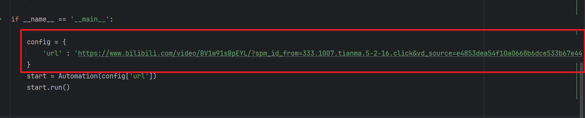

# B站弹幕自动化爬取

## 项目介绍

基于`DrissionPage`自动化工具的数据爬取，实现自动打开网页，自动开启弹幕，自动播放视频，自动化爬取弹幕数据等功能。

## 使用指南

* #### 环境配置
  
  ```python
  window 系统
  python 3.6+
  pip install requirements.txt
  ```

* #### 参数配置
  
  
  
  `url` : 目标网址，想要爬取的目标视频链接

* #### 运行
  
  ```python
  python start.py
  ```

## 缺陷

* #### 速度慢
  
  自动化的通病，尤其在暂停视频播放之后，需要等2，3秒左右才会执行后续的操作。

* #### 数据丢失
  
  相比于抓包爬取，爬取的数据量不容乐观，低的只有50%，高的话只达到了91%

* #### 主页面限制
  
  在打开网页之后，不要将网页窗口隐藏在后台，否则平台将不会推送弹幕，从而爬取不到数据

* #### 耗时长
  
  需要让视频正常播放完毕，已经开启了3.5倍速，对于长视频而言是一大痛点。

## 许可证

本项目基于 **MIT License** 开源。 
你可以自由使用、修改和分发本项目，但需保留原作者署名和许可证声明。
