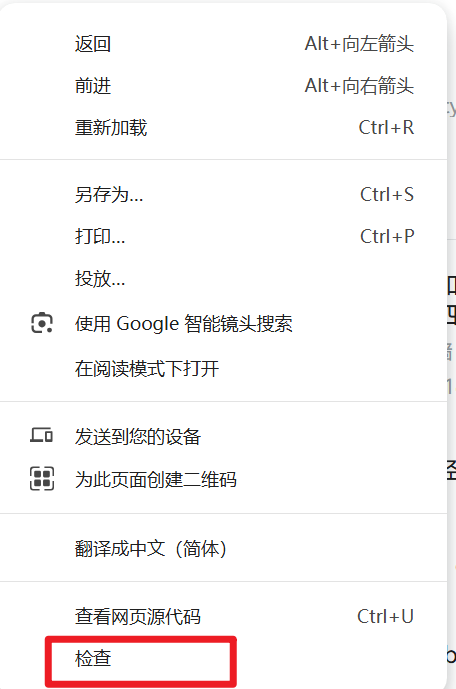

# B站弹幕数据获取

## 介绍

基于`requests`库实现对B站弹幕数据的爬取，仅能获取弹幕的内容，未涉及发布者信息与发布时间等相关字段。

## 使用指南

* #### 环境配置
  
  ```python
  window 系统
  python 3.6+
  pip install requirements.txt
  ```

* #### 参数配置
  
  
  
  `BVD` : 视频信息的唯一标识字符，获取过程如下：
  
  
  
  `cookies` : 访问网页的身份验证，获取过程如下：
  
  1. 打开视频链接
  
  2. 按 `F12`键打开开发者工具，或者右键页面，点击`检查`就可以打开开发者工具
     
     
     
     点击`Network`，记得打开`recoding`
     
     
  
  3. 点击刷新重新加载页面
  
  4. 在搜索框输入`https://www.bilibili.com/video/`
     
     
     
     点击下方红色框，向下滑动，找到`cookie`字段,复制红色框的内容到`config`的`cookies`字段
     
     

* #### 运行
  
  ```pyth
  python start.py
  ```

## 分析

与其他B站案例逆向分析类似，可参考（实际是太懒了）。

## 许可证

本项目基于 **MIT License** 开源。 
你可以自由使用、修改和分发本项目，但需保留原作者署名和许可证声明。
