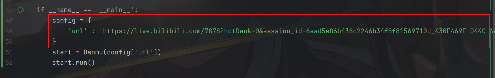

# b站直播间弹幕数据自动化爬取

## 介绍

基于`DrissionPage`自动化工具的python自动化脚本，通过监听`DOM`树变化获取新增的弹幕数据，包括弹幕内容、发布时间、用户、用户个人空间链接等字段。

## 使用指南

* #### 环境配置
  
  ```python
  window 系统
  python 3.6+
  node.js
  pip install requirements.txt
  ```

* #### 参数配置
  
  
  
  `url` : 目标网址

* #### 运行
  
  ```python
  python start.py
  ```

## 分析

使用自动化来实现数据的获取依托的是网址html页面的响应，相应的可以通过DOM树的变化来获取新增的弹幕数据，而不是获取特定容器的整体弹幕数据，使用`MutationObsever`接口实现对DOM树的监听。

## 许可证

本项目基于 **MIT License** 开源。 你可以自由使用、修改和分发本项目，但需保留原作者署名和许可证声明。


