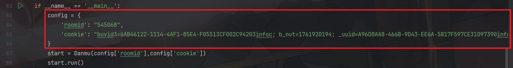
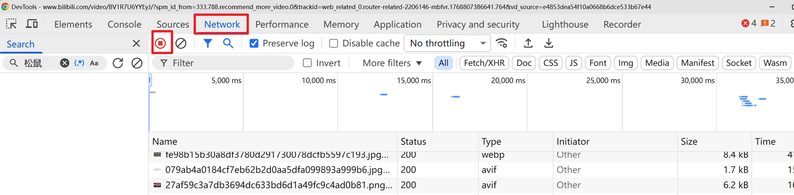
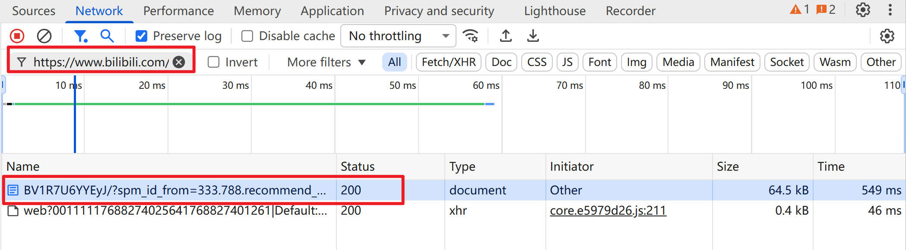
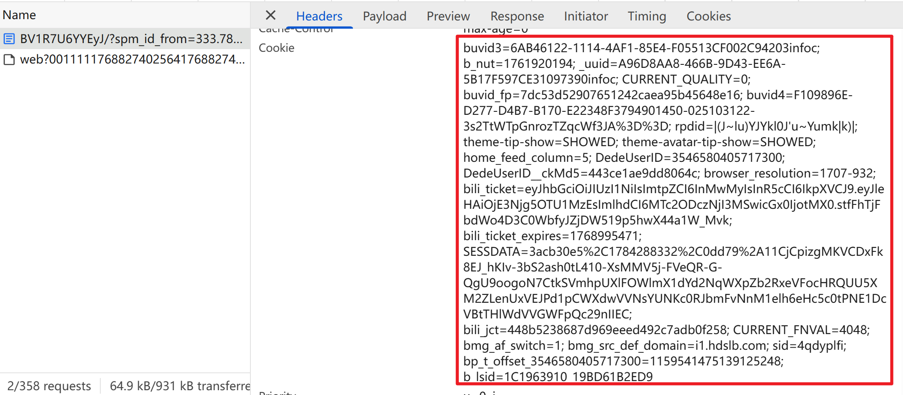
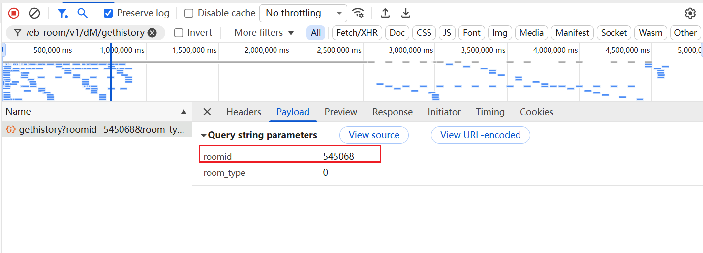

# b站直播间弹幕爬取

## 介绍

基于`requests`库的python自动化脚本，可以爬取实时的直播间弹幕数据，包括文本、用户名、用户空间链接等字段。

爬取的字段如下：


## 使用指南

* #### 环境配置
  
  ```python
  window系统
  python 3.6+
  pip install -r requirements.txt
  ```

* #### 参数配置
  
  
  
  `cookies` : 访问网页的身份验证，获取过程如下：
  
  1. 打开视频链接
  
  2. 按 `F12`键打开开发者工具，或者右键页面，点击`检查`就可以打开开发者工具
     
     
     
     点击`Network`，记得打开`recoding`
     
     
  
  3. 点击刷新重新加载页面
  
  4. 在搜索框输入`https://www.bilibili.com/video/`
     
     
     
     点击下方红色框，向下滑动，找到`cookie`字段,复制红色框的内容到`config`的`cookies`字段
     
     
  
    `roomid` : 直播间信息的唯一标识字符，获取过程如下：
  
  
  
  搜索`/xlive/web-room/v1/dM/gethistory`，点击相应的`url`信息，点击`Payload`,即可找到`roomid`。

* #### 运行
  
  ```python
  python start.py
  ```

## 分析

属于简单的案例，直接全局搜索初始的弹幕信息即可找到数据接口，需要重复请求才能获取最新的数据，每次十条有效数据，其中存在上次请求的重复数据，需要进行去重处理。

## 许可证

本项目基于 **MIT License** 开源。 你可以自由使用、修改和分发本项目，但需保留原作者署名和许可证声明。
