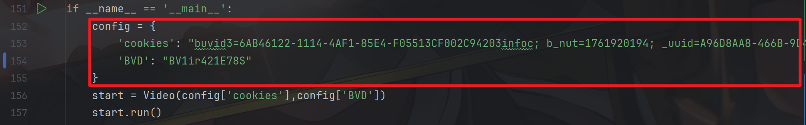
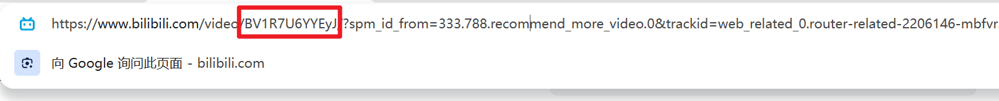
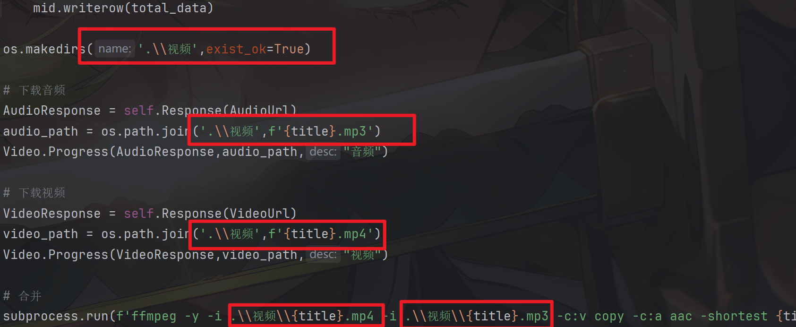
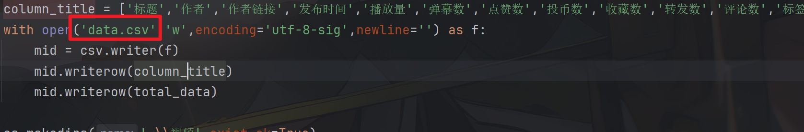

# B站视频信息获取

## 项目介绍

这是一个基于`request`库的python爬虫脚本，可以将视频文件下载到本地，同时可以获取相关的视频信息，包括`标题`、`作者`、`作者链接`、`发布时间`、`播放量`、`弹幕数`、`点赞数`、`投币数`、`收藏数`、`转发数`、`评论数`、`标签`、`视频链接`、`音频链接`等多个字段的内容。

爬取的字段如下：


## 使用指南

- ### 环境配置
  
  ```python
  window系统
  python 3.6+
  pip install -r requirements.txt
  ```

- #### 参数配置
  
  
  
  `cookies` : 访问网页的身份验证，获取过程如下：
  
  1. 打开视频链接
  
  2. 按 `F12`键打开开发者工具，或者右键页面，点击`检查`就可以打开开发者工具
     
     
     
     点击`Network`，记得打开`recoding`
     
     
  
  3. 点击刷新重新加载页面
  
  4. 在搜索框输入`https://www.bilibili.com/video/`
     
     
     
     点击下方红色框，向下滑动，找到`cookie`字段,复制红色框的内容到`config`的`cookies`字段
     
     
  
  `BVD` : 视频信息的唯一标识字符，获取过程如下：
  
  
* #### 运行
  
  ```python
  python 1.py
  ```

## 注意事项

* 路径的修改
  
  
  
  
  
  可以自行修改视频的下载位置，默认是在py文件所在的目录位置创建一个名为“视频”的文件夹，将相应的视频保存在其中。
  
  `csv`文件默认是存储在py文件所在的目录位置，即跟py文件处于同一级。

## 分析

属于简单的案例，并未涉及逆向，难点在于思路，即音视频`URL`的存放位置

播放视频的时候在`network`页面发现大量的`m4s`文件，且具有相同的编号，全局搜索编号发现一个`URL`的响应内容存放着相应的`URL`，且相应的视频信息也在其中。

## 许可证

本项目基于 **MIT License** 开源。 
你可以自由使用、修改和分发本项目，但需保留原作者署名和许可证声明。
