# B站视频评论爬取

## 项目介绍

这是一个半自动化的b站视频评论爬取的`python`脚本，可以将页面中的所有评论爬取到本地的csv文件，支持日志查询、爬取进度显示、断连备份、重试机制等功能。

爬取的字段如下：

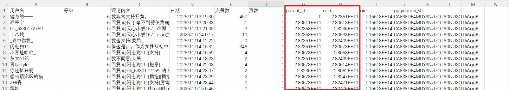

可以筛选页数查看同一页的评论数据。

其中的`parent_id`用于查看回复的是哪一条评论，`rpid`是每一条评论的唯一字段，主评论的`parent_id`为0，表示这条评论是主评论，并不是回复评论，`parent_id`不为空的字段对应回复的评论的`rpid`字段。

可以通过筛选`parent_id`查看回复某一条评论的所有评论。

## 使用指南

* 环境配置
  
  ```python
  python 3.6+
  pip install -r requirements.txt
  ```

* 必要参数配置
  
  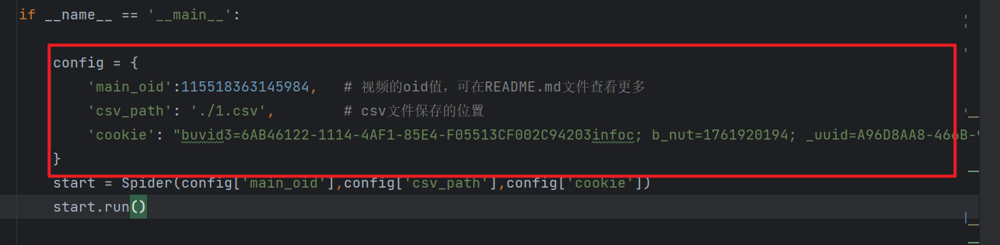
  
  `main_oid` : 视频的oid值，获取过程具体如下：
  
  1. 打开视频链接
  
  2. 按 `F12`键打开开发者工具，或者右键页面，点击`检查`就可以打开开发者工具
     
     
     
     点击`Network`，记得打开`recoding`
     
     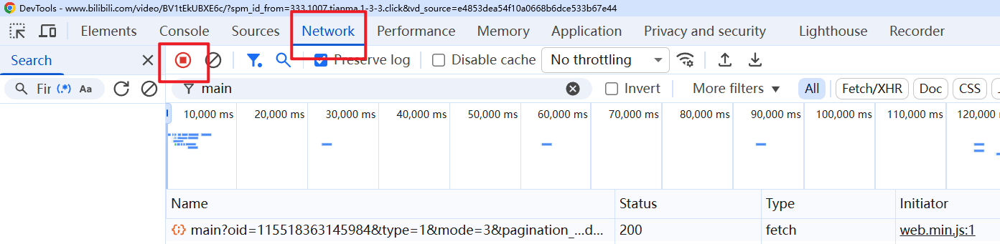
  
  3. 看原页面（b站视频页面），向下滑动，等待评论页面加载出来
     
     
  
  4. 复制`/x/v2/reply/wbi/main`，点击筛选，粘贴到输入框
     
     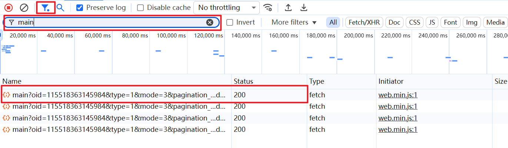
     
     点击下方的红框，点击`Payload`，复制我们需要的`oid`值
     
     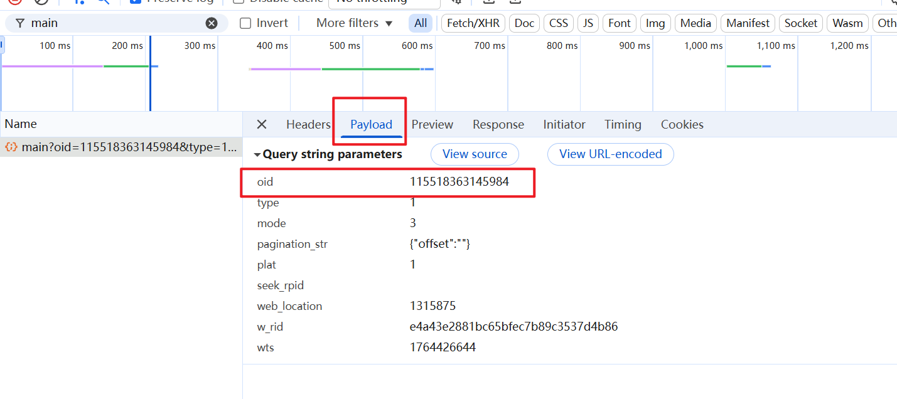
  
  `csv_path` : `csv`文件保存的位置，注意路径要写正确，不要出现**中文路径！！！**
  
  `cookie` : 同`main_oid`的操作，区别在于最后一步点击`Headers`,往下滑，复制`Cookie`字段
  
  **注意：** 一定要使用`”“`双引号包裹
  
  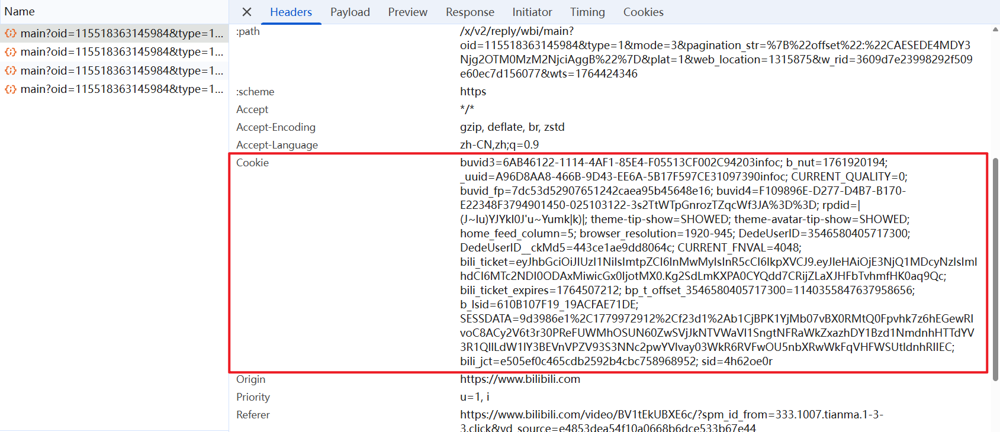

* 运行
  
  ```python
  python 1.py
  ```

## 功能介绍

* 日志查询
  
  ```python
  # ----------------------
  # logging配置
  # ----------------------
  logger = logging.getLogger('SpiderLogger')
  logger.setLevel(logging.INFO)
  handler = RotatingFileHandler('spider.log',maxBytes=5*1024*1024,backupCount=3,encoding='utf-8')
  formatter = logging.Formatter("[%(asctime)s] [%(levelname)s] %(message)s")
  handler.setFormatter(formatter)
  logger.addHandler(handler)
  ```
  
  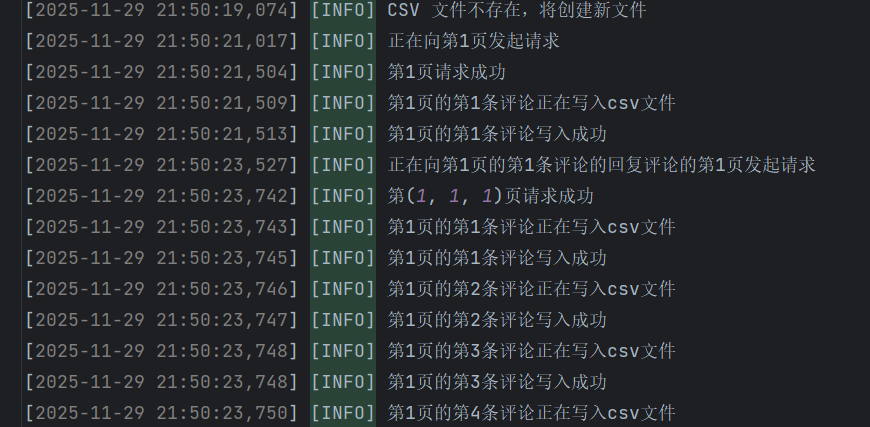

* 爬取进度显示
  
  在控制台会有输出每次爬取的状态（成功或者失败），以及爬取的页数
  
  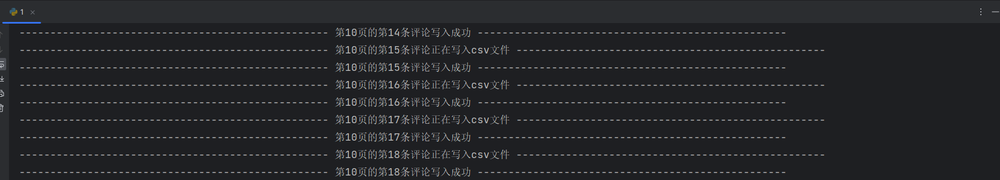

* 断连备份
  
  如果爬取过程因为各种原因中止了爬取进程，在下次爬取时并不需要重新爬取已经爬取过的数据，会在上一次爬取数据的基础上继续爬取新的数据，避免了数据覆盖

* 重试机制
  
  使用了自行封装的重试装饰器，最多3次重试次数，同时使用了指数避让，每次失败后`sleep`的时间指数式爆炸，起到防风控的作用。

## 逆向分析

搜索相应的评论信息找到数据包


这个数据包使用`GET`请求，请求头字段并没有进行加密，对携带的参数`w_rid`、`wts`进行了加密。

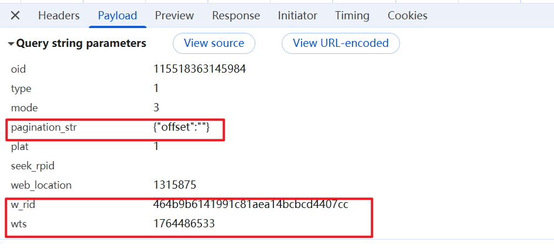

其中，`wts`显然是时间戳，所以只需要分析`w_rid`即可。

`pagination_str`中的`offset`是下一页的游标，用来实现分页功能，下一页在请求时需要携带这个参数，他藏在上一页的响应中。

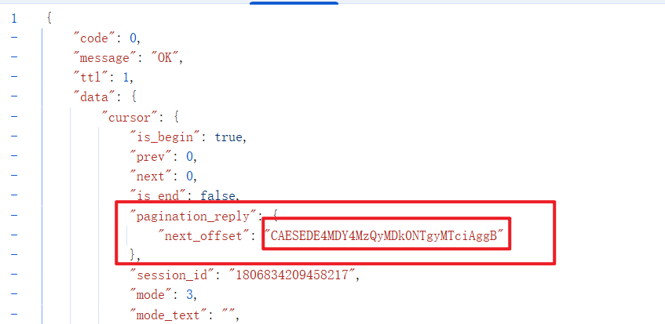

全局搜索`w_rid` ，找到解密位置

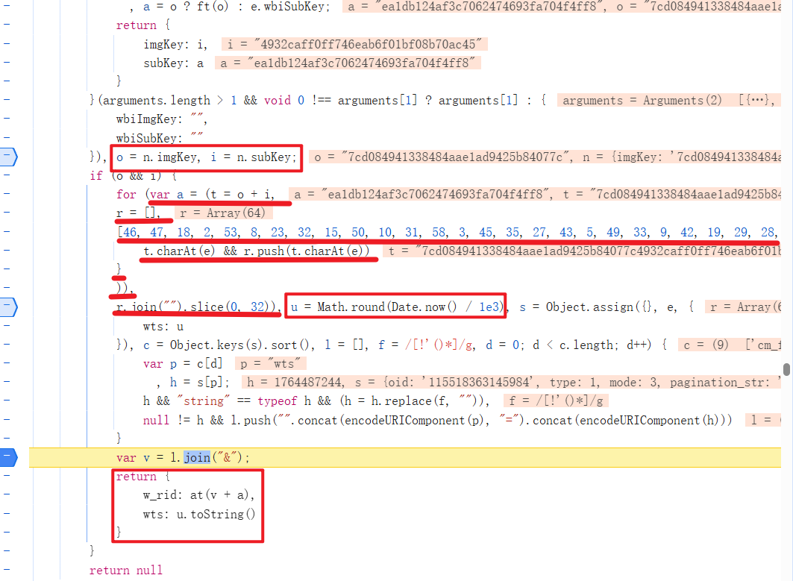

其中`wts`由`u.toString()`得来，`w_rid`由`at(v + a)`得来。

`at`函数构造发现是一个`MD5加密`，直接在本地`node.js`环境构造即可。

而`a`由画下划线的语句构造而成，其中的`o`和`i`可以直接写死。

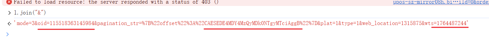

`v`由关键语句`l.join("&")`加载而成，发现是发起请求携带的参数，可以直接在本地构造，注意需要修改画横线的部分。

到这里逆向部分完成，更多分页细节查看代码部分自行分析。这是个简单的逆向案例。

## 许可证

本项目基于 **MIT License** 开源。 
你可以自由使用、修改和分发本项目，但需保留原作者署名和许可证声明。
